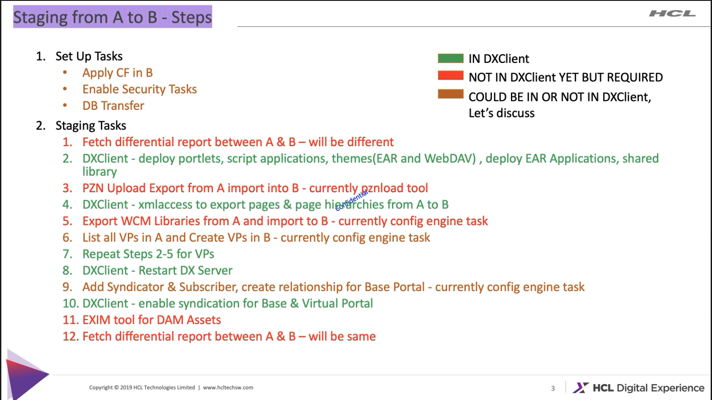

## Requirements

- A proper installed Operator deployment is existing
- The installed DX release version should be the same for the operator and HELM deployment to minimize conflicts
- Use the same database for the operator and the HELM deployment to also minimize conflicts

## Idea of migration path

The migration will be separated in three major steps.

- Extracting kube config's and create a HELM extracted-values.yaml
- Deployment of a new DX instance via HELM charts and the extracted-values.yaml
- DX component migration

### Extracting kube config's and create the helm extracted-values.yaml

#### Extracting configuration data from the Operator deployment

Extracting related configuration values from Operator deployment to adjust the values of the helm deployment. The following parameter may be important to look at if you manually adjusted these.

- default.repository
- image and tags
- pullpolicy
- which applications are enabled
- cors configuration
- hybrid configuration
- request/limit - cpu and memory
- minreplicas, maxreplicas, targetcpuutilizationpercent, targetmemoryutilizationpercent
- persistent volume configuration (storageclass, ...)
- custom resource labels
- node selector configuration (for DX Core)

The extracted values may need to be transfered it into a custom values.yaml helm file. 

##### Extracting the values from the dxctl property file

Via this approach we should only analyse the DXCTL property file and extract the config values from there. This extracted config values can be use to create a custom values.yaml file. 

### Deployment a new DX instance via HELM charts and the extracted-values.yaml

Using the extracted-values.yaml from the operator deployment to get an adjusted HELM deployment. Run the HELM install CMD.

For example:
```
helm install -n <namespace> -f ./extracted-values.yaml <suffix> hcl-dx-deployment
```

### DX component migration

The following components we need to migrate from the operator to the HELM deployment

##### Core:
- Custom Themes
- Custom Portlets
- Pages
- WCM content/libs
- DAM assets
- Personalization rules (PZN)
- Credential Vault
- Virtual Portals

##### Customer extensions:
- Shared libs
- Resource Environment Providers
- Some special WAS configs
- Extensions like preprocessor, filters, ...
- ...
##### DAM:
- Collections, Items, Metadata
- Assets (binaries)

We have checked three approaches to migrate the DX Core components and customer extensions.

- Using the [dxclient](https://git.cwp.pnp-hcl.com/websphere-portal-incubator/enchanted-dxclient) tool
- Creating and deploying the initial release - [HCL public documentation](https://help.hcltechsw.com/digital-experience/8.5/deploy/dep_initial.html)
- Profile migration

To migrate the DAM data, we have have two options.

- Using the [EXIM](https://git.cwp.pnp-hcl.com/websphere-portal-incubator/media-library/tree/develop/packages/exim) tool
- Using a manual backup and recover path

#### DX Core and customer extensions migration

##### dxclient

The [dxclient](https://git.cwp.pnp-hcl.com/websphere-portal-incubator/enchanted-dxclient) tool should be a good option to do that. For the most DX core components provided the tool a export and import functionality. But some components are missing also it is a problem to cover all the customer stuff, like some extensions, preprocessors, filters and what ever. Besides of that, the export can also be taking really long time, if the customer has create many pages or WCM data.



##### Creating and deploying the initial release

The [initial release](https://help.hcltechsw.com/digital-experience/8.5/deploy/dep_initial.html) approach is creating a PAA application from some of the most DX core components, but also not for all. Also here the export and import can be taking really long time, if the customer has create many pages or WCM data.

At the end this approach has not worked. The export process was successful but the import has some issues. I haven open a bug ([DXQ-18719](https://jira.cwp.pnp-hcl.com/browse/DXQ-18719)) for that.

##### Profile migration

The profile migration was a idea from Thomas, which it looks like is a really good approach to do that. How it works this?

- Transferring the DB data - it is only relevant if the customer decide to use a new DB instance
- Stop the core package from HELM deployment
- Transfer the 'wp-profile' data from the operator deployment to the helm deployment
- Changed the database via the WAS console - it is only relevant if the customer decide to use a new DB instance
- Also we should fixed all hardcoded absolute URLs (like the URLs for the DAM assets)

#### DX DAM migration

##### EXIM

Using the [EXIM](https://git.cwp.pnp-hcl.com/websphere-portal-incubator/media-library/tree/develop/packages/exim) tool. The tool helps us to exports and imports all metadata and binaries. But it has some missing functionality and bugs, which are needs to solved it at first. I have open some stories and bugs to solve this.

- [DXQ-18810](https://jira.cwp.pnp-hcl.com/browse/DXQ-18810) - [EXIM](https://git.cwp.pnp-hcl.com/websphere-portal-incubator/media-library/tree/develop/packages/exim) are using always ports, but the kube deployment are not exporting some ports
- [DXQ-18812](https://jira.cwp.pnp-hcl.com/browse/DXQ-18812) - [EXIM](https://git.cwp.pnp-hcl.com/websphere-portal-incubator/media-library/tree/develop/packages/exim) has also a problem with the connection agains the Kube deployment.
-  [DXQ-18813](https://jira.cwp.pnp-hcl.com/browse/DXQ-18813) - The import from binaries are not working as expected.
- [DXQ-18814](https://jira.cwp.pnp-hcl.com/browse/DXQ-18814) - The import from metadata are not working as expected, the reason is that the DAM collections access rights are not transferred.

###### Workaround to solve it:

- Before we can import the metadata, we should transfer manually the binaries from the operator deployment to the HELM deployment. The binaries are located in the DAM persistent volume under the `dx-dam-media` folder.

- Also we should transfer manually all DAM collections resources permissions. Via XMLAccess we can extract all DAM collections resources permissions. For this export we should use the `/opt/HCL/PortalServer/doc/xml-samples/ExportAllDamCollections.xml` file to do that. And the generated XML output should be used to import it on the HELM deployment side.


If all DAM data's are transferred successful, we need to adjust the stored references to WCM assets in WCM. The references are stored as fully qualified URLs. For this problem exists solution to set a alternate hostname. 

[WCM DAM alternate hostname](https://pages.git.cwp.pnp-hcl.com/Team-Q/documentation/docs/documentation/portal/wcm-dam-alternate-host/)

##### Backup and recover

The following documentation provided a manual backup and recovery way. But it looks that the documentation is not in a good shape.

- https://help.hcltechsw.com/digital-experience/9.5/containerization/backup_and_recovery_procedures.html
- https://support.hcltechsw.com/community?id=community_question&sys_id=9e73a02e1b20b850f37655352a4bcbaa

## Summary

Migration from operator-based to helm-based deployments will only be possible with exactly one DX version (presumable CF198). Both deployments have to be at  the same version level.

- Moving *Kubernetes configurations*:
  We will only provide documentation on how to extract configurations from an existing operator-based deployment using dxctl and how to interpret these. We will also document how a customer would be able to reflect these in their custom values.yaml for their helm-based deployment.

- For the *DX Core migration* the best approach is to copy the wp_profile from the operator-based deployment to the helm-based deployment. We expect other connected infrastructures (e.g. LDAP) to remain unchanged, hence no configuration changes are necessary.

- *DX Core database* should just stay the same, hence no further changes would be necessary after copying the WAS profile. The old database needs to be reachable from the new helm-based deployment. If a customer needs to change the connected database, he can use database transfer tooling to move database content between the database instances.

- For *DX DAM* the DAM EXIM tool would be the preferred way. Unfortunately the EXIM implementation is not finished yet. Therefore the DAM move between an operator-based and a helm-based deployment will need to be done using Postgres database export/import and a copy of the DAM's binary storage. If EXIM gets finished in time, we can consider changing the documentation appropriately.
