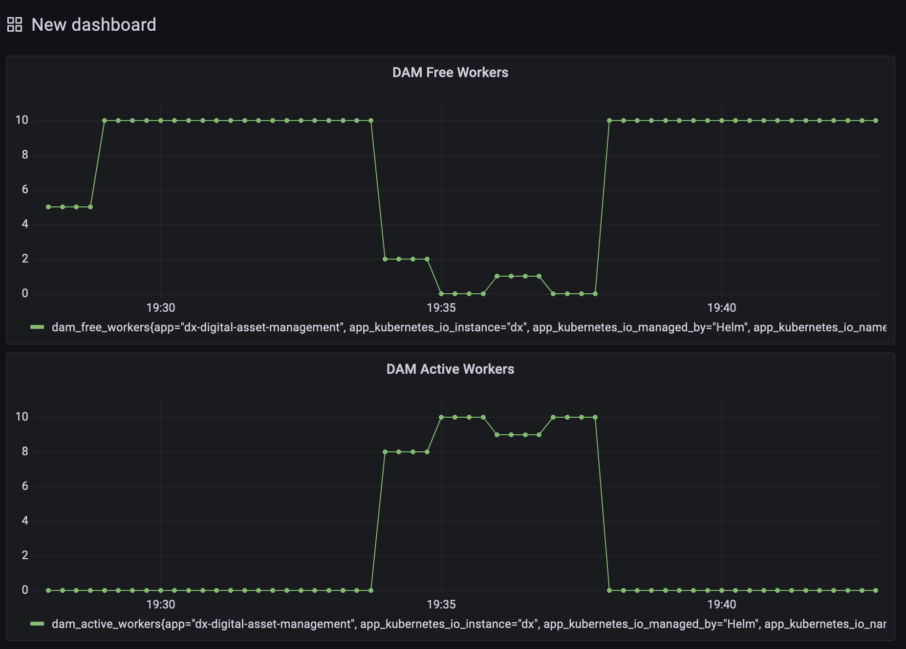

## PoC Goals

The goal is to evaluate how we can expose Prometheus compatible metrics in our NodeJS applications and expose metrics via the main NodeJS process of one of our applications. The outcome of that PoC should be documented so it can be reused for a thorough implementation in our NodeJS applications as required.

For this PoC, the DAM is used as an example application. Due to the similar structure of all skeleton based NodeJS projects, the steps shown here can be re-used in other applications like RingAPI as well.

## Prepare application to expose metrics

### Install prom-client to the server package

We use the package [prom-client](https://github.com/siimon/prom-client) to generate Prometheus compatible metrics. This package exposes NodeJS default metrics and is also able to expose custom metrics if desired.  

```shell
cd packages/server-v1
npm install --save prom-client
```

After the install is successful, the prom-client can be used.  

### Expose metrics endpoint

The prom-client itself is only creating a Prometheus compatible data structure, but not exposing those via any HTTP endpoint.  

Therefore, we create a metrics probe endpoint at the path `/probe/metrics`. Since application metrics and logging are mostly infrastructure related information, choosing this path appeared appropriate.  

We create the file `/packages/server-v1/src/probes/metrics.probe.ts` with the following contents:  

```javascript
/*
 ********************************************************************
 * Licensed Materials - Property of HCL                             *
 *                                                                  *
 * Copyright HCL Technologies Ltd. 2021. All Rights Reserved.       *
 *                                                                  *
 * Note to US Government Users Restricted Rights:                   *
 *                                                                  *
 * Use, duplication or disclosure restricted by GSA ADP Schedule    *
 ********************************************************************
 */

import { NextFunction, Request, Response } from 'express';
import * as client from 'prom-client';
import { loggerFactory } from '@enchanted-prod/logger';

const logger = loggerFactory();

client.collectDefaultMetrics({
	gcDurationBuckets: [0.001, 0.01, 0.1, 1, 2, 5], // These are the default buckets.
});

/*
* This probe provides prometheus consumable metrics.
*/

export class MetricsProbe {
  public metricsProbeHandler = async (req: Request, res: Response, next: NextFunction) => {
    logger.debug('Metric Probe is called.');
    const reg = client.register;
    const defaultMetrics = await reg.metrics();
    return res.send(defaultMetrics).status(200);
  }
}
```

After that, we adjust the file `/packages/server-v1/src/probes/index.js` to also include the metrics endpoint.  

```javascript
/*
 ********************************************************************
 * Licensed Materials - Property of HCL                             *
 *                                                                  *
 * Copyright HCL Technologies Ltd. 2021. All Rights Reserved.       *
 *                                                                  *
 * Note to US Government Users Restricted Rights:                   *
 *                                                                  *
 * Use, duplication or disclosure restricted by GSA ADP Schedule    *
 ********************************************************************
 */

export * from './ready.probe';
export * from './live.probe';
export * from './metrics.probe';

```

With that configured, we are now able to enable the endpoint inside the `/packages/server-v1/src/server.ts` where the other probes are already in place:  

```javascript
    const readyProbe = new ReadyProbe(this.lbApp, this.operationScheduler);
    this.app.use('/probe/ready', readyProbe.readyProbeHandler);
    const liveProbe = new LiveProbe();
    this.app.use('/probe/live', liveProbe.liveProbeHandler);
    // Expose the metrics probe endpoint
    const metricsProbe = new MetricsProbe();
    this.app.use('/probe/metrics', metricsProbe.metricsProbeHandler)
    const staticUi = new StaticUi();
```

With that configured, the DAM Pod will now expose metrics data at `/probe/metrics`.  

### Add custom metrics

To expose custom metrics, we can leverage prom-client again and add custom metrics like counters or gauges.

The example adds the gauge values `dam_active_workers` and `dam_free_workers` as a custom metric.

Therefore we add two custom gauges in the file `/packages/server-v1/src/operations/scheduler.ts`.

```javascript
const activeWorkerGauge = new client.Gauge({ name: 'dam_active_workers', help: 'Active workers handling operations.' });
const freeWorkerGauge = new client.Gauge({ name: 'dam_free_workers', help: 'Free workers ready for operations.' });
```

It contains the name of the metric, as well as a text description that will be shown as a help for the metrics values.

Whenever the count of active or free workers change, we need to update the previously created gauge by setting the new value.

```javascript
  activeWorkerGauge.set(this.activeWorkers.workers.length);
  freeWorkerGauge.set(this.freeWorkers.workers.length);
```

In case of DAM, we enhance the `activeWorkers` and `freeWorkers` arrays to trigger the update of the gauges themselves whenever workers are added to or removed from it.

## Deploying DAM with NodeJS metrics enabled in Kubernetes

For building the image and pushing it to artifactory, a build pipeline for DAM has been used on PJT.

### Deploy DX including the DAM image with metrics

The DX deployment used in this PoC is running on k3s locally and with a minimal configuration.

The Helm Charts used are `hcl-dx-deployment-v2.0.0_20210716-1545_rohan_develop.tgz`.

Only DAM, Core, Persistence, Image Processor, RingAPI and Ambassador are deployed, with a minimal request set of resources.

The following custom values are being used for deployment:

```yaml
#********************************************************************
#* Licensed Materials - Property of HCL                             *
#*                                                                  *
#* Copyright HCL Technologies Ltd. 2021. All Rights Reserved.       *
#*                                                                  *
#* Note to US Government Users Restricted Rights:                   *
#*                                                                  *
#* Use, duplication or disclosure restricted by GSA ADP Schedule    *
#********************************************************************

# Prometheus DAM PoC values, smallest deployment

# Image related configuration
images:
  # Container repository used to retrieve the images
  repository: "quintana-docker.artifactory.cwp.pnp-hcl.com/dx-build-output"
  # Image tag for each application
  tags:
    core: "v95_CF197_20210802-055523_rohan_develop_6107af8e"
    digitalAssetManagement: "v1.9.0_20210802-1721_pjd_feature_DXQ-16661-prom-exporter-poc"
    imageProcessor: "v1.10.0_20210721-1401_rohan_release_95_CF197"
    persistence: "v1.10.0_20210727-1300_rohan_release_95_CF197"
    ringApi: "v1.10.0_20210726-1106_rohan_develop"
    ambassadorIngress: "1.5.4"
    ambassadorRedis: "5.0.1"
  # Image name for each application
  names:
    core: "core/dxen"
    digitalAssetManagement: "core-addon/media-library"
    imageProcessor: "core-addon/image-processor"
    persistence: "core-addon/persistence/postgres"
    ringApi: "core-addon/api/ringapi"
    ambassadorIngress: "common/ambassador"
    ambassadorRedis: "common/redis"

# Resource allocation settings, definition per pod
# Use number + unit, e.g. 1500m for CPU or 1500M for Memory
resources:
  # Content composer resource allocation
  contentComposer:
    requests:
      cpu: "100m"
      memory: "128Mi"
  # Core resource allocation
  core:
    requests:
      cpu: "1000m"
      memory: "3072Mi"
  # Design Studio resource allocation
  designStudio:
    requests:
      cpu: "100m"
      memory: "128Mi"
  # Digital asset management resource allocation
  digitalAssetManagement:
    requests:
      cpu: "250m"
      memory: "1G"
  # Image processor resource allocation
  imageProcessor:
    requests:
      cpu: "100m"
      memory: "1280Mi"
  # Open LDAP resource allocation
  openLdap:
    requests:
      cpu: "200m"
      memory: "512Mi"
  # Persistence resource allocation
  persistence:
    requests:
      cpu: "250m"
      memory: "512Mi"
  # Remote Search resource allocation
  remoteSearch:
    requests:
      cpu: "500m"
      memory: "768Mi"
  # Ring API resource allocation
  ringApi:
    requests:
      cpu: "100m"
      memory: "128Mi"
  # Ambassador ingress resource allocation
  ambassadorIngress:
    requests:
      cpu: "200m"
      memory: "300Mi"
  # Ambassador Redis resource allocation
  ambassadorRedis:
    requests:
      cpu: "100m"
      memory: "256Mi"
  # Runtime Controller resource allocation
  runtimeController:
    requests:
      cpu: "100m"
      memory: "256Mi"

applications:
  contentComposer: false
  core: true
  designStudio: false
  digitalAssetManagement: true
  imageProcessor: true
  openLdap: false
  persistence: true
  remoteSearch: false
  ringApi: true
  ambassador: true
  runtimeController: false
```

### Install Prometheus

To install prometheus, we use Helm.

Add Prometheus Helm Chart Repo to Helm:

```shell
helm repo add prometheus-community https://prometheus-community.github.io/helm-charts
```

We can extract the default values via Helm:

```shell
helm show values prometheus-community/prometheus > prom-values.yaml
```

We'll use the following values for a simple PoC deployment of Prometheus, disabling persistence and additional services.

```yaml
serviceAccounts:
  alertmanager:
    create: false
  nodeExporter:
    create: false

alertmanager:
  enabled: false
nodeExporter:
  enabled: false

server:
  enabled: true
  persistentVolume:
    enabled: false
  service:
    type: NodePort

pushgateway:
  enabled: false
```

Install the Prometheus Application:

```shell
helm install prometheus prometheus-community/prometheus -n prom -f prom-values.yaml
```

Find the NodePort that is used and access Prometheus:

```shell
NODEPORT=$(kubectl get -o jsonpath="{.spec.ports[0].nodePort}" services prometheus-server -n prom)
echo $NODEPORT
```

You can now access Prometheus using your Browser:

`http://<NODE_IP>:<NODE_PORT>`

### Adjust DAM Pods to be scraped by Prometheus

Add the following annotations to the DAM Pods in the StatefulSet to have Prometheus automatically scrape the metrics endpoint.

```shell
kubectl edit StatefulSet dx-digital-asset-management -n prom 
```

```yaml
spec:
  template:
    metadata:
      annotations:
        prometheus.io/scrape: "true"
        prometheus.io/path: "/probe/metrics"
        prometheus.io/port: "3000"
```

The DAM Pod will be restarted shortly and Prometheus should scrape the DAM Pod.


### Configure a test dashboard for DAM

You can use the metrics `dam_active_workers` and `dam_free_workers`.

Here is a sample JSON which can be used:

```json
{
  "annotations": {
    "list": [
      {
        "builtIn": 1,
        "datasource": "-- Grafana --",
        "enable": true,
        "hide": true,
        "iconColor": "rgba(0, 211, 255, 1)",
        "name": "Annotations & Alerts",
        "type": "dashboard"
      }
    ]
  },
  "editable": true,
  "gnetId": null,
  "graphTooltip": 0,
  "id": null,
  "links": [],
  "panels": [
    {
      "datasource": null,
      "fieldConfig": {
        "defaults": {
          "color": {
            "mode": "palette-classic"
          },
          "custom": {
            "axisLabel": "",
            "axisPlacement": "auto",
            "barAlignment": 0,
            "drawStyle": "line",
            "fillOpacity": 0,
            "gradientMode": "none",
            "hideFrom": {
              "legend": false,
              "tooltip": false,
              "viz": false
            },
            "lineInterpolation": "linear",
            "lineWidth": 1,
            "pointSize": 5,
            "scaleDistribution": {
              "type": "linear"
            },
            "showPoints": "auto",
            "spanNulls": false,
            "stacking": {
              "group": "A",
              "mode": "none"
            },
            "thresholdsStyle": {
              "mode": "off"
            }
          },
          "mappings": [],
          "thresholds": {
            "mode": "absolute",
            "steps": [
              {
                "color": "green",
                "value": null
              },
              {
                "color": "red",
                "value": 80
              }
            ]
          }
        },
        "overrides": [
          {
            "__systemRef": "hideSeriesFrom",
            "matcher": {
              "id": "byNames",
              "options": {
                "mode": "exclude",
                "names": [
                  "dam_free_workers{app=\"dx-digital-asset-management\", app_kubernetes_io_instance=\"dx\", app_kubernetes_io_managed_by=\"Helm\", app_kubernetes_io_name=\"hcl-dx-deployment\", app_kubernetes_io_version=\"95_CF197\", controller_revision_hash=\"dx-digital-asset-management-554ccc9d7b\", helm_sh_chart=\"hcl-dx-deployment-2.0.0\", instance=\"10.42.0.75:3000\", job=\"kubernetes-pods\", kubernetes_namespace=\"prom\", kubernetes_pod_name=\"dx-digital-asset-management-0\", release=\"dx\", statefulset_kubernetes_io_pod_name=\"dx-digital-asset-management-0\"}"
                ],
                "prefix": "All except:",
                "readOnly": true
              }
            },
            "properties": [
              {
                "id": "custom.hideFrom",
                "value": {
                  "legend": false,
                  "tooltip": false,
                  "viz": true
                }
              }
            ]
          }
        ]
      },
      "gridPos": {
        "h": 8,
        "w": 12,
        "x": 0,
        "y": 0
      },
      "id": 4,
      "options": {
        "legend": {
          "calcs": [],
          "displayMode": "list",
          "placement": "bottom"
        },
        "tooltip": {
          "mode": "single"
        }
      },
      "targets": [
        {
          "exemplar": true,
          "expr": "dam_free_workers",
          "interval": "",
          "legendFormat": "",
          "refId": "A"
        }
      ],
      "title": "DAM Free Workers",
      "type": "timeseries"
    },
    {
      "datasource": null,
      "description": "",
      "fieldConfig": {
        "defaults": {
          "color": {
            "mode": "palette-classic"
          },
          "custom": {
            "axisLabel": "",
            "axisPlacement": "auto",
            "barAlignment": 0,
            "drawStyle": "line",
            "fillOpacity": 0,
            "gradientMode": "none",
            "hideFrom": {
              "legend": false,
              "tooltip": false,
              "viz": false
            },
            "lineInterpolation": "linear",
            "lineWidth": 1,
            "pointSize": 5,
            "scaleDistribution": {
              "type": "linear"
            },
            "showPoints": "auto",
            "spanNulls": false,
            "stacking": {
              "group": "A",
              "mode": "none"
            },
            "thresholdsStyle": {
              "mode": "off"
            }
          },
          "mappings": [],
          "thresholds": {
            "mode": "absolute",
            "steps": [
              {
                "color": "green",
                "value": null
              },
              {
                "color": "red",
                "value": 80
              }
            ]
          }
        },
        "overrides": []
      },
      "gridPos": {
        "h": 8,
        "w": 12,
        "x": 0,
        "y": 8
      },
      "id": 2,
      "options": {
        "legend": {
          "calcs": [],
          "displayMode": "list",
          "placement": "bottom"
        },
        "tooltip": {
          "mode": "single"
        }
      },
      "targets": [
        {
          "exemplar": true,
          "expr": "dam_active_workers",
          "interval": "",
          "legendFormat": "",
          "refId": "A"
        }
      ],
      "title": "DAM Active Workers",
      "type": "timeseries"
    }
  ],
  "refresh": "10s",
  "schemaVersion": 30,
  "style": "dark",
  "tags": [],
  "templating": {
    "list": []
  },
  "time": {
    "from": "now-15m",
    "to": "now"
  },
  "timepicker": {},
  "timezone": "",
  "title": "New dashboard",
  "uid": null,
  "version": 0
}
```

The output looks like this:



### Using existing Grafana Dashboards

There are also existing Grafana dashboards that can be leveraged.

One that is related to NodeJS and `prom-client` can be found here [Grafana Dashboard 11159](https://grafana.com/grafana/dashboards/11159).

## Conclusion

The use of `prom-client` enables us to easily expose default NodeJS metrics as well as custom applications metrics that are bound to our application logic. The implementation is straight forward and the main effort lies within defining metrics that should be exposed.

We will need to adjust our Helm charts to add the necessary annotations to all application Pods that expose metrics for prometheus. With that, prometheus will automatically scrape those applications and aggregate the metrics data.

The NodeJS default metrics also allow for in-depth analysis on performance issues, that can be seen in monitoring of the NodeJS runtime.