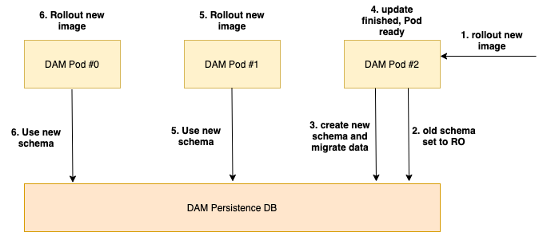
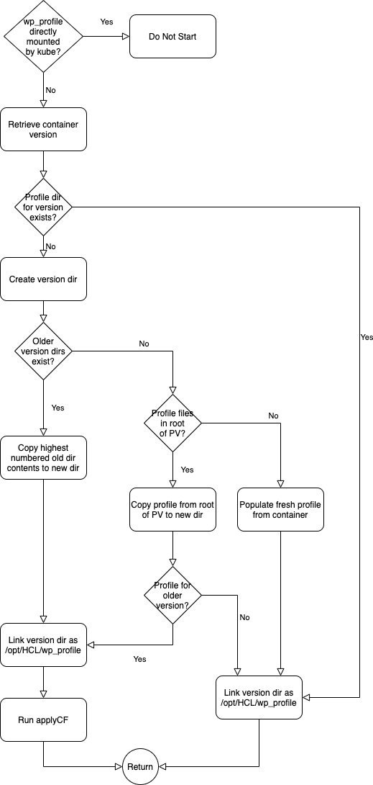

| Status | Date |
| --- | ---|
| **APPROVED**| [29th of April 2021](https://pages.git.cwp.pnp-hcl.com/Team-Q/development-doc/architecture-community/2021-04-29) |

## Introduction

This document compiles all the outcomes of the different design and PoC documents that have been created for our Kubernetes Next Deployment. Each section might contain one or multiple milestones. All sections of the same milestone should be considered as a new "release" of the Kubernetes Next strategy.

## Design Summary

### Helm as the primary deployment method

We want to leverage Helm as our primary way of deployment. Helm will exactly define what resources are being created during the deployment. Resources in our deployment will ideally **only** be created or deleted with Helm. Update and Rollback tasks would be issued using Helm as well.

The Helm chart will contain suitable default settings for a default deployment and also allow customers to customize as much of the deployment as possible for their needs. All the configuration will be determined by `values.yaml` - as per the Helm standard.

DXCTL would still be an option for customers who don't want to use Helm. The deployment procedure that DXCTL will use will be directly and programmatically derived from our Helm chart, thus enabling the Helm chart to be our *single point of truth* regarding deployment structure.

#### Milestone 1
**Summary**  
Providing a simple, fresh deployment via Helm.  
**Limitations**  
- no official support for other ambassadors, OS-routes,... to reduce test effort
- dxctl as a deployment option will follow in a later milestone
### Runtime Controller with focus on operation/controller tasks

Based on [What is a Kube Operator](https://www.redhat.com/en/topics/containers/what-is-a-kubernetes-operator) we are not building an operator but a runtime controller. The wording needs to be precise here since the term *operator* implies certain functionalities which we are explicitly avoiding with a runtime controller.

Instead of the focus on deploying and reconciling resources with a CRD, the runtime controller will focus on operational topics. Part of this is that it should not have to take care of application logic, that ideally should be handled by our applications themselves. The runtime controller should not act as a mitigation strategy for lack of application capabilities, but rather help with application-specific tasks and behaviors. 

This would include e.g. automatic rollout of configuration changes from ConfigMaps, verification of Kubernetes resource changes, overall health metrics, support during backup and restore procedures.

#### Milestone 1
**Summary**  
- Create a new runtime controller with
  - DAM persistence RW/RO failover
  - Autorollout config changes via Pod-Recycle

- Configuration changes via Helm
  - Enable (disable) services like DAM
  - Service configurations (DAM file size limits, CORS,..)
  - Scaling Settings
- Horizontal Pod Autoscaler
- SSL certificate management for Ambassador and services
- DX Admin credential management (Secrets)

**Limitations**
- Deployment cannot run old operator and new runtime controller at the same time
- SSL certificate management will only cover shipping the current certificate

#### Milestone 3
**Summary**  
- auto renewal of interservice SSL certificates

### ConfigMaps as configuration backbone

Since CRDs are cluster-wide resources that require special care (e.g. versioning), we will go with ConfigMaps as our single way of passing configuration values.
CRDs also cannot be updated using Helm, which already poses issues for our SoFy deployments.

Validation of ConfigMaps could be achieved by using VerificationHooks that call the runtime controller for sign-off on changes.
#### Milestone 1
**Summary**  
Changes in ConfigMaps will be rolled out automatically by the runtime controller since our Containers are consuming ConfigMap values only on startup.

**Limitations**
- No verification Hooks
### Containers need to be more self-sustaining

Our applications, especially the stateful ones, need to be improved to behave more naturally in a Kubernetes / Containerized Environment. This is especially true for DX Core. 

Currently, the operator mainly defines how DX Core starts, behaves and updates. Some of this will have to go into the DX Core container and away from the newly planned runtime controller.
#### Milestone 1
**Summary**  
DX-Core will become more self-aware. By definition of kube, containers have the naming scheme &lt;pod-name&gt;-&lt;incrementing integer&gt; like `dx-core-0` to `dx-core-(n-1)` where `n` is the number of Pods.  

`dx-core-0` will be the first core pod created and therefore:
- run initialization of the profile
- run db transfer for multi-pod environments

All other pods will not start until:
- init is done
- db transfer has happened
  - This logic can apply in kube and docker-compose environments if we apply the same name schema to the pods/containers.

After initialization, pods will be notified (by Helm or the Runtime Controller) of config changes via a `checksum` environment variable. When any pod starts it will compare this value to the config checksum value stored on the shared profile persistent volume. If the value has changed, then the pod will apply the configuration changes and afterwards update the value in the profile. Because of the order in which kube recycles pods in a stateful set when the spec changes, the pod making the changes should in practice always be `dx-core-(n-1)`.

**Limitations**
- providing a docker-compose file is a stretch goal
### Vanilla as possible, Custom as needed

To keep the support for multiple Kubernetes platforms as easy as possible and the deployment maintainable for us, we want to use as few Kubernetes flavour-specific resources as possible. Furthermore we want to leverage as much as possible of the OOB functionality that Kubernetes provides for our applications regarding deployments, updates, scaling etc.

This would also mean the we try to get away from seemingly different deployment behaviors on different flavours, like Openshift vs GKE.

#### Milestone 1
**Summary**  
Dropping the support of OS routes for Kubernetes Next deployments. Still relying on shared volumes where provided, NFS-Containers as a workaround where needed.

**Limitations**
- tbd
### Enable logging using Kubernetes logs

We will use the sidecar container concept to expose as many logs from DX and its applications as possible, so that customers can directly use Kubernetes standard tools to retrieve them.

In the future we could provide a fully fledged logging stack, that uses this logging concept and provides customers with proper logfile management.

#### Milestone 1
Not considered in this milestone.

### Establish a metrics/monitoring stack

We will expose application-specific metrics in our containers that can easily be consumed by software like Prometheus and allows customers to establish proper monitoring.

In the future we could also provide our own monitoring stack allowing customers to easily see the current status of their deployment.
#### Milestone 1
Not considered in this milestone.

### Rolling update
We will provide a rolling upgrade capability so customers can easily update their deployment. A Rolling update does not imply a deployment with zero downtime for all features. However zero downtime is possible for rendering.
#### Milestone 1
Not considered in this milestone since there is nothing to update from.
#### Milestone 2
**Summary**  
By design kube always updates Statefulsets by picking the pod with the highest number first. In all other scenarios kube picks a random pod. Pods are always upgraded one at a time. Once this pod is ready, the next pod will be upgraded.

DAM is self-aware of its own updates. If a database change is needed, DAM will take care of it based of the release-to-release migration.
1. Kube recycles pod with new image - if no DB change is necessary proceed with step 4.
2. The new pod is initializing release-to-release migration.
3. The new pod is performing the release-to-release migration.
4. Once the migration is done it marks itself ready via ready-probe.
5. Kube updates the next pod with the new container image.
6. Kube updates the next pod until there are none on the old image version.

Core image will be modified to support rolling updates. This will not change the core build itself but only the wrapping container.
1. Kube recycles pod with new image
2. Pod will create a new, cloned wp_profile directory on the shared volume
3. Pod will switch its own symlink from wp_profile to the cloned, versioned wp_profile
4. Pod will perform the actual upgrade and marks itself ready via ready-probe
5. Kube updates the next pod.
6. Pod checks if the new wp_profile directory exists and adjusts own symlink prior to startup
7. repeat steps 5 and 6 until there are no further pods on the old image

The following flowcharts give more detail:

**Limitations**
- helm only upgrade
- no rollback possible
- stick with shared volume
- writes for DAM will have a downtime
- wp_profile changes from old core pods might be lost during upgrade

### Undeploy
#### Milestone 1
**Summary**  
Use `helm uninstall` to remove the deployment. PVs will not be removed.

**Limitations**
- we do not clean up parts from the current Kubernetes strategy

### Operator/Runtime Controller technology stack
As mentioned earlier within this document we are not building a fully fledged operator. Therefore we do not need to rely on an operator framework to manage CRDs etc. Based on the skillset within the DX development team we decided that the official kuberenetes client for Java is capable of everything we need and are therefore building a Java based runtime controller.
#### Milestone 1
**Summary**  
Creating a first version of the runtime controller including proper build, lint and test CI/CD. We also need a proper development setup based on maven and make files.
