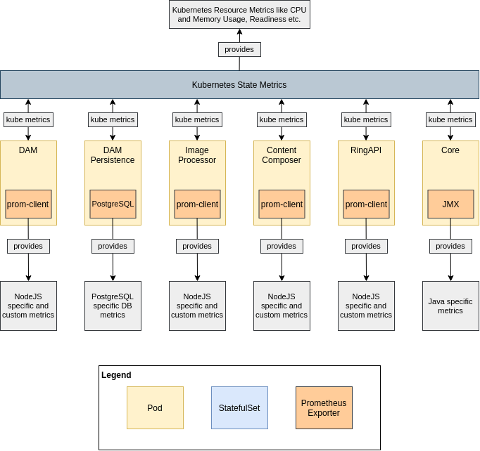
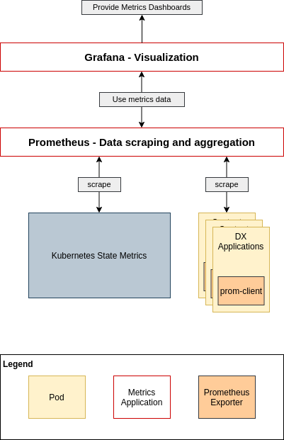
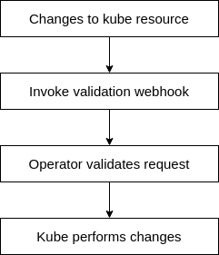

## Introduction

We want to provide a easy to maintain, reliable and transparent Kubernetes deployment.
From a operation perspective this means that customers should have the ability to know exactly in what state their deployment is, what resources are maintained, how to create backups and do restores etc.

This document provides a proposal on how this deployment could look like.

## Deployment structure

### Overview

#### Application Overview

#### Operator influence

### Deployed applications

#### DX Core

**Kubernetes Type:** *StatefulSet with two persistent volumes (1x RWM, 1x RWO)*

The DX Core application is currently our application with the highest complexity in the Kubernetes deployment.
This is mainly driven by the fact that DX Core, unlike our new applications, was not designed for a containerized deployment.

The original deployment of DX Core in a clustered fashion usually relied on having multiple Machines / Nodes that have WAS ND deployed.
WAS ND would then consist of deployment manager (DMGR) and multiple nodes - This is called a Cell. The primary configuration of all applications would be maintained on the DMGR and then synced throughout the Cell to all nodes. The applications, in our case DX, would be running on multiple nodes and be therefore highly available.

In a containerized deployment, the goal is usually to get away from such stateful units. Especially the DMGR would be difficult.
To get around that issue and still have a highly available deployment (and scalability) we leverage the "Farming" approach for deployment.

In that case, each node - or in terms of Kubernetes: Pod - will access a shared persistent storage containing the DX profile, there is no DMGR that defines the profile and pushes it to the node. All nodes see the same profile at all time. 

The farming deployment brings certain issues with it, that should be mentioned:

- ConfigEngine Tasks can and **must** only be run on **one** DX instance at a time. Other instances in the farm are not allowed to run those tasks.
- All Nodes / Pods require a **shared** persistent file storage, which will then usually be something like NFS.

To ensure that only one DX Pod is performing the initial setup in Kubernetes and runs ConfigEngine tasks, the current implementation leverages an operator which ensures that before tasks are run / init is done, only one DX Pod is running. That has the following implications:

- Startup behavior of DX Core is completely defined by the operator, the container image itself remains relatively "dumb"
- During configurations DX Core is not highly available and no load balancing between multiple Pods is possibly, since only one Pod is running
- There is a distinct relationship between DX Core and the operator. Versions of both must be matched or a successful operation is not guaranteed/supported

There are multiple ways to go:

- Keep an operator that ensures that only DX Core Pod is running to prevent multiple execution of ConfigEngine Tasks / Writing conflicts
- Enhance the DX Core image + Kubernetes deployment to allow DX Core to have a consensus based configuration

The preferred way would be having a **consensus based** deployment of multiple Pods containing DX Core. This means, that there would also be one elected **leader** Pod, which executed ConfigEngine tasks, while there are one or multiple **follower** Pods, which just read the profile.
Also it could be thought about, having a persistence sync from leader to followers which is not using a *RWM* Volume. This would ease deployments, since not all cloud providers allow for RWM volumes.

Using a consesus based deployment could dramatically reduce the dependency to an operator and could possibly allow for maintaining HA during configuration changes.

#### RingAPI

**Kubernetes Type:** *Deployment/ReplicaSet - stateless*

The RingAPI is a simple part of our deployment. It basically performs API wrapping actions for DX Core. It does not have any persistence, neither via a DB connection nor via a persistent volume. Thus scaling, initialization and running requires no application specific specialties.

#### Content Composer

**Kubernetes Type:** *Deployment/ReplicaSet - stateless*

The Content Composer is a web application that consumes APIs provided by the RingAPI. It mainly consists of a web server that hosts static JS files used for the web application. It does not have any persistence, neither via a DB connection nor via a persistent volume. Thus scaling, initialization and running requires no application specific specialties.

To use content composer integrated in DX, it is necessary to run a ConfigEngine task.

#### DAM

**Kubernetes Type:** *StatefulSet with one persistent volume (1x RWM)*

The Digital Asset Management is a web application that consists of a UI and an API server. The API server uses a persistent volume and a database to provide functionality. DAM is designed to have no writing conflicts between multiple Pods. The application itself will ensure that all configuration tasks are only performed by **one** Pod. There is not special startup or initialization that needs to be performed by an operator or similar.

To use DAM integrated inside DX, it is necessary to run a ConfigEngine task.

#### DAM Persistence

**Kubernetes Type:** *Two StatefulSet with two persistent volumes (1x RWO, 1x RWO)*

The DAM Persistence consists of a RW leader and a RO follower, both having their own persistent volume. Replication is maintained by application logic (PostgreSQL).

Since our current implementation of PostgreSQL has **no** real HA or loadbalancing, we currently use an operator to automatically switch over to RO if the RW Pod dies.

This dependency on an operator must be removed for multiple reasons:

- Switchover from RW to RO is not zero-downtime
- No load balancing between multiple PostgreSQL Pods
- No scaling for load surges, we are basically limited to vertical scaling (e.g. allow for much CPU and Memory on a single DB instance)
- Operator switchover adds complexity to the deployment
- Operator switchover forms a possibly single point of failure

The solution to that is to have a properly scalable Persistence Layer, e.g. HA PostgreSQL.
With such a setup, the manually build switchover can be removed and the necessity for a DAM operator vanishes.

#### Image Processor

**Kubernetes Type:** *Deployment/ReplicaSet - stateless*

The image processor is a very simple API based computing application that performs image manipulation. The Pod is completely stateless, therefore scaling, initialization and running requires no application specific specialties.

#### Conclusion

Our current implementation of operations using operators is mainly based on certain issues with our applications themselves. Instead of building solutions to handle the symptoms, we should focus on fixing them to make such constructs obsolete and reduce complexity. The goal in a containerized deployment should be to make applications ready for it and not force applications not made for it into a specific deployment structure.

> Side note: Having operators carrying much logic also has implications for customers that may not want to use Kubernetes, but rather just docker because they are just trying out things or want to quickly spin up development environments. Since operators rely on Kubernetes for their actions, all functionality they provide will not be directly available outside Kubernetes. Having our container images taking more responsibility for themselves allows customers and developers to get a faster start with DX.

## Monitoring / Metrics

We need to enable monitoring capabilities for our customers. This topic can be split into two parts:

- Health/Monitoring data exposure
- Data Aggregation and Visualization

It is worth having a look at the current implementation of the SoFy team, which at least provides monitoring out of the box for Kubernetes seemingly using Prometheus and Grafana.

### Health/Monitoring data exposure

All our application Pods should expose a metrics endpoint that can be scraped by a metrics data aggregation tooling. The endpoint should ideally be available at the same port for all Pods, thus making the configuration easier and more straight forward. The format should orient on what is best practice, e.g. the Prometheus format.

#### Kubernetes Resource Data

Kubernetes itself provides metrics using the [Kube state metrics](https://github.com/Kubernetes/kube-state-metrics). This contains metrics regarding Kubernetes resources like nodes and Pods.
The data provided by the metrics are in a Prometheus consumable format.

#### Java Application Data

For Java we can leverage the [JMX Exporter](https://github.com/prometheus/jmx_exporter). It provides metrics about the state of a JVM in a Prometheus consumable format.

#### NodeJS Application Data

For NodeJS we can use the [Prom-Client](https://github.com/siimon/prom-client). It is a npm package that provides various metrics regarding the NodeJS eventloop, heap usage etc. It also allows to configure custom metrics that can be exposed. The data format is Prometheus consumable.

#### DB / PostgreSQL Data

For our current persistence stack we can use [PostgreSQL Exporter](https://github.com/prometheus-community/postgres_exporter). It exposes various DB related metrics and stats directly coming from the database itself. The output format is Prometheus consumable.

### Data Aggregation

All metrics data exposure is worthless if we don't gather that data somewhere central. For that purpose applications like [Prometheus](https://prometheus.io/) should be used. Prometheus is a scraping + persistence engine that will automatically scrape configured endpoints for exported metrics in a defined interval. It allows for specific querying to view data. There are already existing [prometheus helm charts](https://github.com/prometheus-community/helm-charts) that could be leveraged as a dependency or inspiration in our helm charts.

For visualization Grafana may present a good choice. It is widely adopted and provides out of the box compatibility with Prometheus. It also comes with a default set of [helm charts](https://github.com/grafana/helm-charts/tree/main/charts/grafana).

## Logging

It is important that our customers are able to easily access logs during runtime. This is necessary for them to configure e.g. notifications based on certain log messages, as well as for debugging issues.

### Using Sidecar Containers for log exposure

The Kubernetes stack already provides a logging mechanism which exposes logs of containers / Pods. The logs maintained here are based of the stdout and stderr streams of the containers and their respective running application.

This principle has a disadvantage: Whenever your application uses something different for logging, e.g. typically files, you may only be able to tail the output of one file during runtime, thus only expose one log file in the Pod.

Kubernetes provides the [concept of sidecar containers](https://github.com/grafana/helm-charts/tree/main/charts/grafana) for exactly that case. Each sidecar container can expose a file as a log stream inside Kubernetes, allowing Kubernetes to log multiple log files of a single application.

Since sidecar containers share the same volumes as the run containers, they can access and tail the log files, allowing for an easy implementation.

### Log output gathering

Since Kubernetes already gathers all log output of Pods and their containers, the usual approach is to gather the logs via Kubernetes itself.

There are two often used ways to do logging in Kubernetes:

- EKF / ELK (Elasticsearch for data aggregation, Kibana for visualization and Fluentd for log data collection)
- Loki + Grafana (Loki for aggregation, Grafana for visualization)

The basic concept behind both is to take the logs of each cluster Node (which include the logs of the Pods running on that cluster), aggregate them and them add a visual interface to access them for monitoring, search and debugging.

## Changing configurations

### Adjusting resource allocations

Changing resource allocations like CPU/Memory requests or limits would be applied directly on the definition of Deployments/ReplicaSets.
When the values have changed, Kubernetes will internally trigger its own reconciliation and roll out the update to the resources.

### Adjusting enabled/disabling applications

If a customer wants to enable/disable particular parts of the deployment, this should be done via the Helm upgrade process. Since we deploy the necessary Resources incl. Routes, StatefulSets etc. directly during deployment and not via an operator, enabling the application in the values.yaml of helm would then create or destroy the resources based on the enablement condition. It would also adjust the configuration of the DX Core Pods, thus leading to the leader of those Pods to configure the application, e.g. DAM.

### Change application configuration

Since we would like to store our configuration in configMaps, we'd like to know when they have changed and rollout the updated configuration.
Therefore we need a mechanism to trigger the rollout of that update via StatefulSets/Deployments.

An easy way to do so, is to add a checksum annotation to the Pods of our StatefulSets/Deployments for each configMap they care about.
As soon as a configMap is changed, the operator will update the checksum of the affected resources and Kubernetes will start to roll out updated Pods or restart them, performing a rolling update.

### Change validation

Our configuration lives within configMaps and Kubernetes resources. Those are created by Helm or with DXCTL using Helm created yaml files.

There are multiple ways to validate changes to the resources we are managing:

#### Using Helm

Helm supports the usage of [schema files for its values.yaml](https://helm.sh/docs/topics/charts/#schema-files). Since all values we use in our deployment are derived from that file during install or upgrade, we can leverage that check.

#### Using Kubernetes validation webhooks

Kubernetes provides the principle of [validation webhooks](https://Kubernetes.io/docs/reference/access-authn-authz/extensible-admission-controllers/). In combination with an operator, that provides validation endpoints, we would be able to reject wrong/undesired changes to configMaps directly in Kubernetes during runtime.

We can also provide fitting error messages that will the customers why the changes they planned to do will not work.

This would not only be applicable to configMaps, but also to other Kubernetes Resources e.g. our Deployments or StatefulSets.

## Application lifecycle

### Initial startup

During the initial startup we need to ensure that DX Core will only run the initialization **once** and only in **one** running Pod.

Since the wp_profile is shared between all Pods, the initialized profile will be available to all Pods after initialization.

The initialization flow could look the following way:

- The desired set of DX Core Pods is created by the StatefulSet
- The Pods negotiate a leader Pod, all others will act as followers.
- The leading Pod will start the initialization process, all other Pods will not start DX Core until the initialization has been completed
- After the initialization has been performed by the leader, all Pods (incl. followers) will start their DX Core process
- The application is initialized and ready to serve

This requires communication between the DX Core Pods, e.g. on the shared volume.
The current state of initialization could be persistent in a lock/timestamp file inside wp_profile.

Other applications like DAM for example do already have initialization logic that prevents multiple Pods from colliding.

### Scaling

We can use HorizontalPodAutoscalers that are included in Kubernetes to automatically scale services up and down based on CPU and memory usage.
In case we want to leverage custom metrics, e.g. DAM operations pressure, there are also ways to establish custom metrics in Kubernetes and use them in autoScalers.

### Backup & Restore

Backup and Restore tasks could be run as Jobs, which are one-off Pods in Kubernetes that fulfill a specific task and return a completion status.
Those jobs could be created by the operator, since they need to be created during the deployments lifecycle.

Creation of those backup tasks could either be triggered manually, or run automatically in defined intervals.

Backups could include copying specific files to backup volumes, dumping deployment information and state or even trigger functions like EXIM in DAM and put the output to a desired spot.

Restoring of before used backups should also be managed by the operator, as it would be able to bring the applications into their desired state before re-importing the data into them. It could also do validate if a restore was successful, e.g. by checking specific health-checks of individual applications.

## Used Kubernetes structures

### Operators/Controllers

There are certain actions inside our deployment that would require manual intervention to get to the desired goal.

The basic principle of watching a type of resource and acting accordingly to changes is considered a controller in the Kubernetes ecosystem.
An operator on the other hand can consist of multiple controllers for different resources and implements applications specific knowledge/actions.

A basic example would be a reaction on configuration changes.
When we change the configMap of one our applications, we want to make that application aware of the introduced changes. This is true for stateful and stateless applications.

A simple, but yet effective way to force the rollout of those changes is to have a annotation at the Pods level, which just contains a checksum of the applications config map. If that checksum changes, the application will automatically cycled through, performing a rollout of the new configuration to all Pods.

Helm could provide the checksum during execution. If the value changes happen in Helm and the customer uses Helm upgrade to apply those changes, we could easily update the annotations during that automatically and the changes will be applied.

Since that builds up a complexity in the Helm charts and e.g. would not work if customers use the plain yaml output with DXCTL, unless we port that functionality to DXCTL.

If the customer applies changes directly in Kubernetes on configMap level, we would not get any automated rollout.

To cover all different aspects of changes to configuration, having an operator that watches configurations and modifies our Pod definitions accordingly, would ease the process for customers a lot and reduce implementation overhead in both Helm and DXCTL.

Other cases where the operator could act with application specific logic:

#### Operator/Controller use cases

##### Leading Pod only Routes

There may be the necessity to have routes that should only go to the leading DX Core Pod. Certain actions, like config changes should only happen in one of our DX Core Pods. The operator could use a leader lookup routine to configure certain routes to point to exactly that Pod, instead of pointing to a Service consisting of multiple Pods.

This would require the operator to check who is the leading DX Core Pod in a regular fashion and update the Endpoint for the corresponding route.

This could be a repeatable pattern, where we could have multiple pre defined Endpoints that share a common label, allowing the operator to apply the change easily to multiple routes at the same time.

##### Automated ConfigMap application

As mentioned in the introduction before, configuration changes on ConfigMap level do not induce a automatic rollout on dependent resources in Kubernetes. This logic needs to be established by us.

The operator could watch all relevant ConfigMaps and adjust the checksum annotation of all dependent resources, e.g. StatefulSets and Deployments. The built in Kubernetes reconciliation would then automatically roll out those changes.

##### DAM persistence RO fallback

As long as we do not have a true loadbalanced HA persistence solution for DAM, we will rely on a ReadWrite Primary and ReadOnly Secondary PostgreSQL instance, which do automatically replicate.

In order to have a fallback in the case of an outage of the primary DB, the operator would change the routing to the DB for DAM automatically to the secondary. This would be restored to use the primary as soon as the primary DB is up and ready again.

##### DX Core configuration Proxy

If we are running multiple instances of DX Core, we want customers to execute configuration changes only on the leading Pod.
The operator could perform a leader lookup and perform as a proxy for such executions.

Instead of directly executing kubectl exec commands in one of the DX Core Pods, they would be pointed to the operator Pod and could either be executed through a direct SSH tunnel to the Core Pod or initiating the Kubernetes exec command on the DX Core Pod.

Customers would not need to know which of the Cores is the current leading one.

##### Leading Pod identification

For configuration and debugging purpose it may be useful to know, which DX Core Pod is currently the leading one.

A simple command that can be triggered in the operator Pod that return the Pod Name could already be sufficient.

For other use cases the operator would already need to know which Pod is leading.

##### Configuration validation

The operator could provide a validation endpoint that can be used to validate the changes to Resources during runtime. This could include type checks and even specific value verification.

##### DX Deployment Specific Metrics

We can use the operator to expose metrics endpoints that aggregate DX deployment relevant health and status information. Since the operator can possibly know all members of the deployment in its namespace, it can act as a point of entry for quick health checks.

### Custom Resources Definition vs. configMaps

A classical operator design usually incorporates the use of a Custom Resource Definition or short CRD.
A CRD is an extension to the Kubernetes API and basically allows for creation of custom resource definitions that reflect whatever is necessary.

In our case, we used a custom resource (CR) called dxDeployment in the past. What content can be inside that CR is defined by the CRD. You could think of the CRD as a schema or object definition, from which you can create Objects inside Kubernetes. This definition can also contain validation of values.
The operator would use this CR as its configuration backbone.

ConfigMaps on the other hand are vanilla Kubernetes resources that contain a list of key-value-pairs. The values of those pairs could either be a single value or even be a whole file structure. Still in the end the principle is always key-value-pair. This is a simple data structure that allows for easy editing, but not so much flexibility in regards of structure.
ConfigMaps, unlike CRs, can be directly consumed in some Kubernetes resources. Pods can either mount configMaps as a volume inside the Containers or extract values from them and set them as environment variables inside Containers. There is no necessary conversion logic that needs to be implemented.

If we perform changes to our configuration, e.g. add a field, we would require the CRD to be updated prior to updating the CR. Also our operator would need the be update, even if it would only pass the configuration field through to another Kubernetes resource.

> Example: We have a CRD that defines certain parts of Pod specification. Unfortunately, we did not incorporate labels in the past. By our implementation logic, we take add the field to the CRD, then enhance the operator to be able to consume that field and pass it on through the Pod definition e.g. inside a StatefulSet.
This apparently small change to just to enable a field for a Pod specification requires changes on CRD definition, changes to operator code, rolling out a new CRD and operator. Alternatively the label could just have directly been added to the StatefulSet in the first place, without being passed through an operator.

Also, there has been a lot of discussion the the Helm community regarding the lifecycle of CRDs. Therefore [Helm does currently **not** support updating CRDs](https://helm.sh/docs/chart_best_practices/custom_resource_definitions/), which will make the use of CRDs with SoFy harder for us and our customers, since SoFy relies on Helm.

Because CRDs define a content/config structure **and** are cluster wide resources, special attention has to go into version updates of CRDs, updating them and testing use/edge cases like having two versions of a CRD in the cluster because two different versions of DX are deployed. (E.g. CF191 and CF193 on SoFy sandbox clusters.)

Since an operator could also watch ConfigMaps as a source of configuration, we would like to use those.

## Glossary

**DMGR:**
Deployment Manager from WAS ND, maintains deployment cells containing multiple WAS nodes.

**WAS ND:**
Websphere Application Server Network Deployment, Java application server used by DX Core.

**Cell:**
In WAS Terms consists of a DMGR and multiple nodes.

**RWO:**
ReadWriteOnce Volume - can only be accessed by one Pod, one to one relationship between volume and Pod.

**RWM:**
ReadWriteMany Volume - can be accessed by multiple Pods, one to many relationship between volume and Pods.