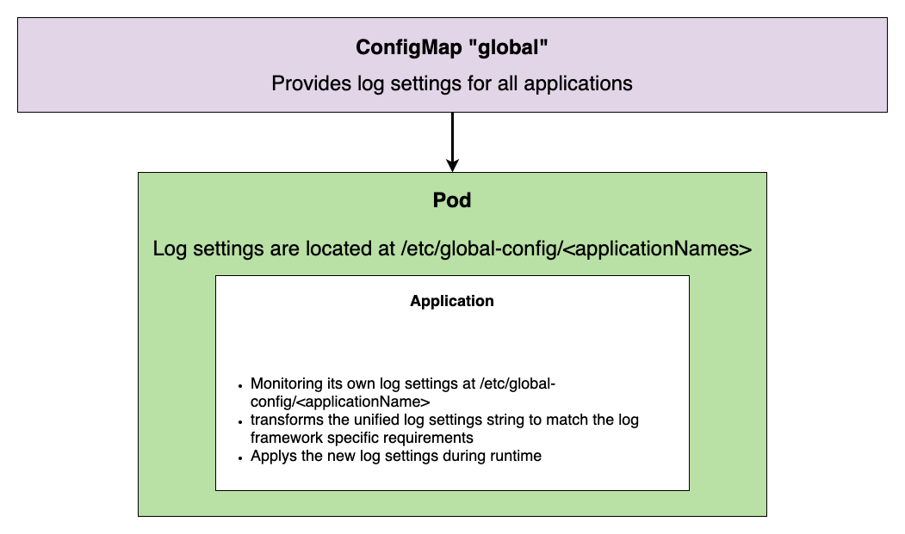

## Introduction

For each application of our DX deployment, we should have a consistent way to set log settings during runtime. Also, the log settings should be stored in a central place. Due to various technologies, different log technologies are used, like:

- DEBUG - NodeJS applications
- LOG4J, JUL - Java applications

The log configuration formats of the different log technologies differ and therefore we need a way to unify/align them. With this proposal we do not intend to adjust the log output format.

## Assumptions / Restriction

- It will only work for applications on a Kubernetes deployment. (DX Core in a hybrid deployment will be excluded)
- Supported applications: DAM, CC, Core, RingAPI, Design Studio, Image Processor, Runtime Controller, Remote Search, DAM Persistence
- Open LDAP logging can not be configured this way
- Only the server log settings will be covered, the UI part is excluded. (Short side note: The logging for the React applications embedded in core will be configured through the same trace settings as for the server.)
- Only available for a HELM-based deployments

## Solution proposal

### General approach

- A global Config Map can be used as a central place for all log settings. The application Config Maps is not a good approach. (It is not a central place and each change will recycle the pods)
- We should also introduce a common log configuration format to align the different log technology formats (like DEBUG, JUL, LOG4J).
- Each application should monitor its own log settings from the global Config Map.
- Each application should also provide a functionality to change log settings at runtime.


#### Global Config Map and monitoring own log settings

Here is an example of how the global Config Map can look.

```
apiVersion: "v1"
kind: "ConfigMap"
metadata:
  name: "{{ .Release.Name }}-global"
  labels:
    app: "{{ .Release.Name }}-global"
    # Using general labels, see _deployment_helpers.tpl
    {{- include "hcl-dx-deployment.labels" . | nindent 4 }}
data:
  "log.core": "<core log information>"
  "log.digitalAssetManagement": "<dam log information>"
```

All log settings are available inside the pods as mounted config maps under `/etc/global-config`. The application-specific log settings in the mounted config map need to be monitored by the application to adjust its log levels during runtime.

This will obviously also require a change to the stateful set / replica set Helm charts to mount the additional config map.

Short example to arrange that.
```
volumeMounts:
- name: "global-config"
  mountPath: "/etc/global-config"

volumes:
  - name: "global-config"
    configMap:
      name: "{{ .Release.Name }}-global"
```

#### Change log settings during runtime

Each application should be able to consume and execute the new log settings without a restart of the application itself. A change of a log setting should be directly applied to the application log components (Logger). And a transformation of the common log format to the application-specific log would be needed.

That means that we will have to do some adjustments to the application itself.

#### Common log settings format

The different logging frameworks offer a variety of levels. These levels will not be unified.

- LOG4J (Java): all, trace, debug, info, warn, error, fatal, off
- JUL: (Java) finest, finer, fine, config, info, warning, severe
- DEBUG (NodeJS): debug, info, error

The usage of wildcards should also be possible. Each section of a single application component must be separated by a unique delimiter, the colon should be a good delimiter.
For a definition of multiple application components, we need also a delimiter, the comma should be a good option for that.

Here is an example of the proposed common log pattern:

```
<component>:<pattern>=<level>,<component>:<pattern>=<level>

- component     >   api, worker, wp_profile, cw_profile, prs_profile, repmgr, pgpool, psql (No Wildcards)
- pattern       >   com.hcl.App, com.hcl.util.Data
- level         >   error, info, debug (Always includes higher levels)
```

LOG4J example:
```
logging framework specific log settings:
com.hcl.App=info
com.hcl.util.Data=finest


- component     >   wp_profile
- pattern       >   com.hcl.App, com.hcl.util.Data
- level         >   info, finest

Common log settings:

wp_profile::com.hcl.App=info,wp_profile::com.hcl.util.Data=finest
```

DEBUG example:
```
logging framework specific log settings:
INFO:api:server-v1:dist*
INFO:worker:server-v1:dist*
DEBUG:api:server-v1:dist:server*

- component     >   api, worker
- pattern       >   dist, dist:server
- level         >   info, debug

Common log message:

api:server-v1:dist=info,worker:server-v1:dist=info,api:server-v1:dist:server=debug,
```

## Supported component names

Each application consists of one or multiple components.

Supported component names are: 

| Application | Supported component names |
| --- | --- |
| `Content Composer` | `api` |
| `Core` | `wp_profile`, `cw_profile` |
| `DAM persistence` | `psql`, `repmgr`, `pgpool` |
| `Design Studio` | `api` |
| `Digital Asset Management` | `api`, `worker`|
| `Image Processor` | `api` |
| `Remote Search` | `prs_profile` |
| `Ring API` | `api` |
| `Runtime Controller` | `controller` |

## Necessary code changes to the currently existing implementation (end of October 2021)

### Core and Remote Search

Adjust the component identifier to use the new component names. Check if the already implemented logic supports log level settings for `cw_profile`. Otherwise create a ticket to ensure the implementation.

### enchanted logger

- Rework the log output format to move the log level to the beginning of the string in caps
- Rework the log settings transformation to match the proposed format
- Adjust the applications to match the components
- Rename the applications in their package.json files to adjust the package name

### Logging 3rd party DEBUG packages

Many other packages like `express` or `loopback` utilize the same logging framework called `DEBUG`. Unfortunately there is no way to change the log level for these packages during runtime. Therefore we need to provide instructions for our support team on how to set tracings for these packages by setting the `DEBUG` environment variable. Adjusting the DEBUG environment variable will change the pod spec which will lead to a restart of the pod. This implicitly resolves the inability to change these log settings during runtime.

## Support log levels

We have decided that we are supporting only three log levels to align the log levels for all our applications. Only DX Core and Remote Search are excluded as they require a more flexible configuration.

Which log levels are we supporting?

```
error, info, debug
```

All NodeJs applications are following this restriction and using only this three log level. For other application (like JAVA) a mapping is needed.

Mapping the levels that can be set in the Helm values to the log levels of the services

| Service | `debug` | `info`  | `error`  |
| --- | --- | --- | --- | 
| **Postgres** | `DEBUG5`, `DEBUG4`, `DEBUG3`, `DEBUG2`, `DEBUG1` | `INFO`, `NOTICE`, `WARNING` | `ERROR`, `LOG`, `FATAL`, `PANIC` |
| **Repmgr** | `DEBUG` | `INFO`, `NOTICE`, `WARNING` | `ERROR`, `ALERT`, `CRIT`, `EMERG` |
| **Pgpool** | `DEBUG5`, `DEBUG4`, `DEBUG3`, `DEBUG2`, `DEBUG1` | `INFO`, `NOTICE`, `WARNING` | `ERROR`, `LOG`, `FATAL`, `PANIC` |
| **Runtime Controller** | `FINEST`, `FINER`, `FINE`, `CONFIG` | `INFO`, `WARNING` | `SEVERE` |
| **Content Composer** | `debug` | `info` | `error` |
| **Digital Asset Management** | `debug` | `info` | `error` |
| **Ring API** | `debug` | `info` | `error` |
| **Design Studio** | `debug` | `info` | `error` |
| **Image Processor** | `debug` | `info` | `error` |


## Log output for NodeJS apps

We move the log level to the front of a log message, thus making the output more similar to other applications e.g. the ones that are based on WAS.

Sample log:
```text
INFO:api:server-v1:dist:server.js[12] hello world
ERROR:api:server-v1:dist:server.js[12] hello world
DEBUG:api:server-v1:dist:server.js[12] hello world
```
