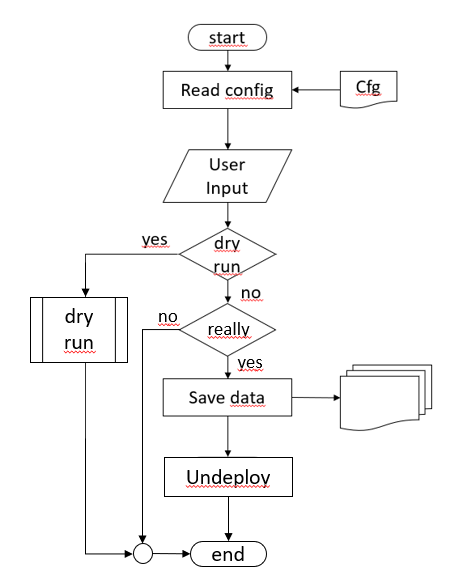

| Status | Date |
| --- | ---|
| **APPROVED**| [29th of April 2021](https://pages.git.cwp.pnp-hcl.com/Team-Q/development-doc/architecture-community/2021-04-29) |

## Introduction

Undeploy unlike delete will not just kill and destroy an existing deployment no matter of the result.
We want to provide an easy to handle, reliable and transparent Kubernetes undeployment.
From the handling perspective this means that customers should have the ability to select what they want to keep (i.e. namespace information, app configurations, data) from the existing deployment.

This document provides a proposal on how this undeployment could look like.

### Initial considerations

To not interfere with running actions within the system (i.e. active client upload, active backup process) an undeployment should run in a fully controlled system. That means no external client interactions should be possible and no ongoing data nor configuration changes should be active.

To drop external interactions manually we need to provide a documentation to the customer on how to do this or we can provide this as an automation before starting the bare undeployment.
For backup and config job we need to provide an automated checkup before the undeployment.

### Minimum undeploy actions

The minimal functionallity for a Kube undeployment is what we currently provide in our automation:

- Delete the namespace (or OpenShift project) which in turn deletes all scoped resoucres under it

### Delete actions not yet provided but maybe considered

In addition to the delete actions we already provide we should add optional actions the customer can choose from.

- Delete CRDs
- Check for possible Kube V1 artifacts

### Save data and configurations

In addition to just deleting the environment we need to provide the capabilty to save data, configurations, and/or deployment informations from the existing environment for import in a new deployment.

This includes the following actions:

- Export current configuration
- Save persistent data
- Save exisitng backups
- Save existing logs

### Undeployment CLI and UI

Besides the pure delete actions the undeployment needs to provide a UI and CLI. An UI would better visualize the user input and actions rather than just running single commands from command line but is not mandatory in the first place.

The CLI/UI takes the appropriate input from the customer:

- List of parts always undeployed (no choice)
- List of undeployable parts the customer can select
- List of data, configurations, deployment information the customer can select to save them
- Dry-Run feature
- Final question if undeployment really should run

### Undeploy process

After the customer has confirmed the undeploy process will start. The undeploy process needs to run seamless for the various Kube flavors. Therefor the process needs a configuration file or runtime parameter to provide default information (i.e. Kube flavor, userid/password, tools to run certain actions, etc.).

Following is an illustration about the straight forward undeploy process. 

### Customer addons

In addition the final undeploy process should provide pre- and post-hooks (customer entry points) for certain actions so the customer can add his own tools and/or flavors.

