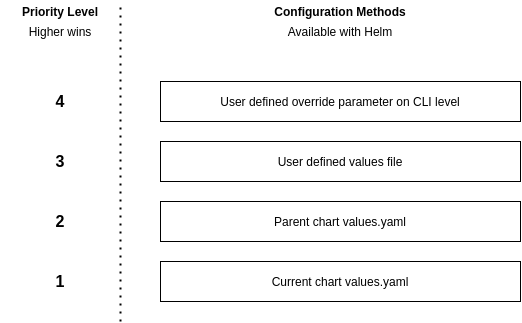
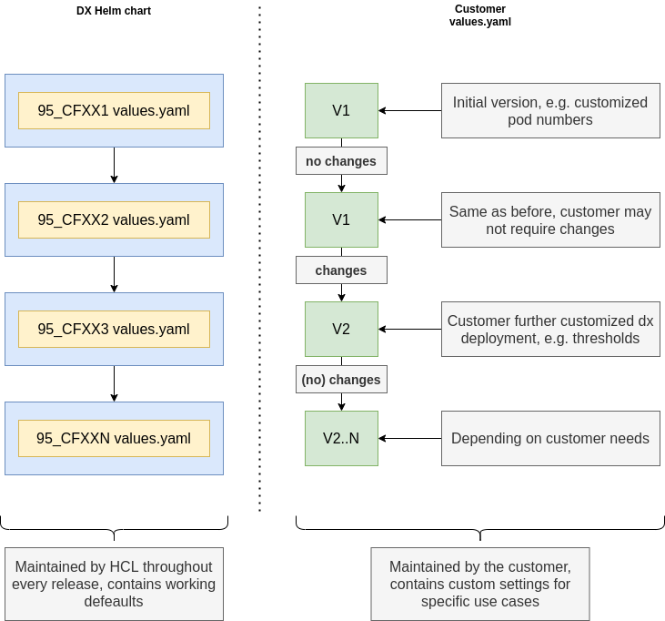

| Status | Date |
| --- | ---|
| **APPROVED**| [22nd of April 2021](https://pages.git.cwp.pnp-hcl.com/Team-Q/development-doc/architecture-community/2021-04-22) |

## Introduction

For our Kubernetes deployments we also need to provide the possibility for customers to do updates.
Ideally for our customers there would be no downtime when they perform an update.

The update process should also cover possibilities to perform rollbacks if necessary.

## Affected Resources

This chapter lists all important resources in our deployments and their requirements regarding updates.

### Stateful Applications

We currently have **three** stateful applications with distinct requirements:

#### DX Core

DX Core uses two persistent storages for its operation. One of them is a (multi-pod shared) persistent volume which contains the wp_profile.
The second persistence is realized using a relational database. That database is **not** part of the current DX Kube deployment. Therefore, all interactions with that DB need to be done by the operation/administration team of the customer OR by DX Core directly.

#### DAM

DAM uses two persistent storages for its operation. One of them is a (multi-pod shared) persistent volume which contains the DAM upload data and acts as a storage for binaries. The second persistence is realized using a relational database in form of PostgreSQL. That database is deployed inside our DX Kube deployments and can therefore be accessed by us during updated directly. It would be possibly for either the operation/administration team of the customer, the DX operator or DAM itself to perform necessary actions on that DB.

#### DAM Persistence (PostgreSQL)

The DAM persistence layer is one of the two persistence parts of DAM. It currently consists of two distinct Pods, where one is a RW primary DB node and the other one is a RO secondary DB node. Both have their own persistent volumes that are **not** shared. The persistence layer container images contain no schemas or application data, since they will be initialized by DAM. Changes to schemas would also be done by DAM. From an update perspective the most important aspect is to keep the existing data storage of the Pods compatible with the new DB version that comes in a newer container. This basically relies on how PostgreSQL behaves between version updates and needs to be verified.

### Stateless Applications

#### RingAPI

RingAPI is a stateless application that only uses configuration parameters and acts as a wrapping API server around DX Core. From an update perspective there are no special requirements that need to be taken into account. Updating RingAPI basically boils down to deploying a new version of the container image.

#### Content Composer

Content Composer is a stateless application that only uses configuration parameters and acts as a webserver hosting the resources for the Content Composer UI. From an update perspective there are no special requirements that need to be taken into account. Updating Content Composer basically boils down to deploying a new version of the container image.

#### Image Processor

Content Composer is a stateless application that only uses configuration parameters and acts as a media transformation service. It only uses HTTP as communication protocol and requires no persistence. From an update perspective there are no special requirements that need to be taken into account. Updating the Image Processor basically boils down to deploying a new version of the container image.

### Configurations

#### ConfigMaps

For general configuration we use two types von ConfigMaps. The first one is an application specific ConfigMap which contains all configuration necessary for individual applications to run. Those ConfigMaps are only consumed by the related application.
The second type of ConfigMap is a global deployment wide ConfigMap, that contains configuration that affects all applications.

The values of these ConfigMap entries will be directly updated during the update process and applications will be informed about the changes.

#### Secrets

For storing secure data like certificates and access credentials, we use Kubernetes Secrets. These secrets will be consumed by our applications. Content of those secrets will be directly updated during the update process and applications will be informed about the changes.

### Utility Resources

Utility Resources e.g. HorizontalPodAutoscalers will be updated directly through the update process.

#### Ambassador deployment

We need to replace Ambassador Resources if they have changes. This will happen directly through the update process.

## Updating

### Backup

Before updating, we need to provide customers with a way to create a backup of the important parts of the deployment. This includes persistent volumes and the data in the DBs of DX Core and DAM.

This could be done by:

- A Kubernetes Job running, triggered by Helm or DXCTL
- The applications themselves before updating the schemas

### Update Categories

Updates we perform can have multiple implications. Based on the way they change existing deployments, we can categorize them in different update categories. Based on in which category an update fits in, different actions or handling might be necessary.

#### A - Application changes

As we implement features and bugfixes to our applications, the application runtime code will change. This can have implications to configuration and persistence schemas, but that is not always the case. Often enough, application logic will be altered, without affecting existing environmental resources.

#### C - Configuration changes

As we perform development on our applications, it might be necessary to either introduce new configuration parameters or alter existing ones to reflect the current state of implementation. It can also happen that default behaviors/values might be adjusted between releases, e.g. if performance assessments have shown, that a Pod needs fewer resources and we lower the Kubernetes resource requests.

#### P - Persistence schema changes

For our stateful applications, such as DAM or DX Core, it may become necessary to perform changes to our persistence schemas. This would usually affect the schema of the DAM DB or the DX Core DB. This can happen if we need to introduce new fields into existing data structures.

#### N - New application introduction

As we move on with our developments for DX, new applications will arise that will be deployed within a DX deployment. Those applications will require new configurations, Kubernetes resources and perhaps preparation. As an example the roll-out of site-manager would fall into this category.

#### R - Removal/replacement of an application

Similar to when we add applications, there may also be parts that will be removed because they perhaps got obsolete or are being replaced with other applications. In that case it is important to ensure that the old resources get cleaned up, the configuration, if necessary, gets removed and the DX deployment is made aware that the application is gone and is not having any dependency anymore.

### Scenario: Update only containing configuration and application changes

During this update the customer can either use helm or dxctl to deploy the new version of our DX deployment. With that, all resources affected will receive their respective changes.

#### Statefulsets

Since we directly define the Statefulsets in our Helm chart, the update will cause them to receive the new specification to the kubernetes resource. Kubernetes itself will then start its reconciliation and will ensure that the Pods of the statefulset will be restarted with the new configuration. See [Statefulset Rolling Update](https://kubernetes.io/docs/tutorials/stateful-application/basic-stateful-set/#rolling-update) for reference.
This logic is implemented in kubernetes itself and will roll out the changes to the application and will only continue updating the next Pod, if the first one has been restarted with the new configuration and got ready.

#### Deployments/Replicasets

Applications that are stateless and run as a Deployment will be receiving the updated specification as well directly via the update process. As soon as the Deployment Resource gets altered, Kubernetes will perform a rollover, spawning new Pods with the new configuration. As soon as the new Pods are running successfully and are ready, the old Pods will be terminated. See [Deployment Rollover Update](https://kubernetes.io/docs/concepts/workloads/controllers/deployment/#rollover-aka-multiple-updates-in-flight) for reference.

#### ConfigMaps/Secrets

ConfigMaps and Secrets will directly be updated via the update process.

#### Utility Resource

Utility Resources like HorizontalPodAutoscalers etc. will directly be updated via the update process.

### Scenario: Update also including persistence schema changes

During this update the customer can either use helm or dxctl to deploy the new version of our DX deployment. With that, all resources affected will receive their respective changes.

#### StatefulSets

Since we directly define the StatefulSets in our Helm chart, the update will cause them to receive the new specification to the kubernetes resource. Kubernetes itself will then start its reconciliation and will ensure that the Pods of the StatefulSet will be restarted with the new configuration. See [StatefulSet Rolling Update](https://kubernetes.io/docs/tutorials/stateful-application/basic-stateful-set/#rolling-update) for reference.
This logic is implemented in kubernetes itself and will roll out the changes to the application and will only continue updating the next Pod, if the first one has been restarted with the new configuration and got ready.

As soon as schema changes are involved, it may become necessary that a preflight task needs to be run to e.g. to migrate a database schema before deploying new Deployments etc.

We could leverage one of the following approaches to run necessary pre-flight tasks:

- Container integrated logic that checks if schema migration tasks are necessary to run
- [Kubernetes Init Containers](https://kubernetes.io/docs/concepts/workloads/pods/init-containers/) attached to the Pods, running specific tasks
- [Kubernetes Jobs](https://kubernetes.io/docs/concepts/workloads/controllers/job/) that run once and report back completion (could also run as a Helm Hook)

While DAM will have automated logic to handle version to version migration of database schemas, for DX Core it might be necessary to perform schema updates that are triggered by the operators/administrators of the customer.

Since we do not directly manage the DX Database ourselves, Database operations would preferably not done by our deployment directly, unless we are sure the logic we implemented in DX Core is failsafe.

#### Deployments/Replicasets

Applications that are stateless and run as a Deployment will be receiving the updated specification as well directly via the update process. As soon as the Deployment Resource gets altered, Kubernetes will perform a rollover, spawning new Pods with the new configuration. As soon as the new Pods are running successfully and are ready, the old Pods will be terminated. See [Deployment Rollover Update](https://kubernetes.io/docs/concepts/workloads/controllers/deployment/#rollover-aka-multiple-updates-in-flight) for reference.

#### ConfigMaps/Secrets

ConfigMaps and Secrets will directly be updated via the update process.

#### Utility Resource

Utility Resources like HorizontalPodAutoscalers etc. will directly be updated via the update process.

## Rollback

Rolling back our application is mostly relying on the fact if our applications can roll back to older persistence schemas.
For disaster recovery we would use the backups done before.

Using those backups of persistent volumes and DBs would allow a customer to go back to a previous version of our deployment, assuming the performed a rollback to the old versions of the deployment e.g. using `helm rollback`.
## Tooling

### Helm

Customers should use `helm upgrade` to perform updates on their existing deployments.

Using helm for upgrades provides both us and our customers with the benefit of hierarchical configurations.

Per default, a helm chart uses the `values.yaml` to determine what values should be used in the deployment. A helm chart is always delivered with that file, since it includes all the necessary default values for the deployment.

For customers there might be customer specific configuration, e.g. scaling settings. We **do not** want customers to have the need to manually copy over their existing settings into our default `values.yaml` OR to copy the new values of the default `values.yaml` into their custom settings file.

This can create merge conflicts, wrong configuration and makes the updating process more complicated for customers.

With the hierarchical nature of helm configurations, we have the following pattern at hand:

Especially important in our case is the use of our default `values.yaml` and a user defined `custom_values.yaml`.

With every version of DX we ship, we will deliver a default `values.yaml` that contains all necessary information to get a DX Kube deployment up and running. This also includes image names, version tags etc.

If a customer wants to customize the deployment, they could either edit our default `values.yaml` and apply the changes, or create their own file and only change the values that are of importance to them. The benefit is quiet obvious: *Customers can keep customized deployment configuration in one file, while we can always ship a fitting set of defaults that does not overwrite the customers values.*

The lifecycle of that configuration can be seen in the following diagram:

Customers can retain their own custom values file, while we always ship a new one with each release. With that, we don't override customer settings, but always deliver working default deployment values.

**Note:** The custom values file approach can also be used to provide different deployment templates to our customers, without overwriting our default `values.yaml`

### DXCTL

DXTCL should ideally be able to consume outputs of the Helm templating engine and use that output to update existing deployments in a similar fashion as it does today already.
